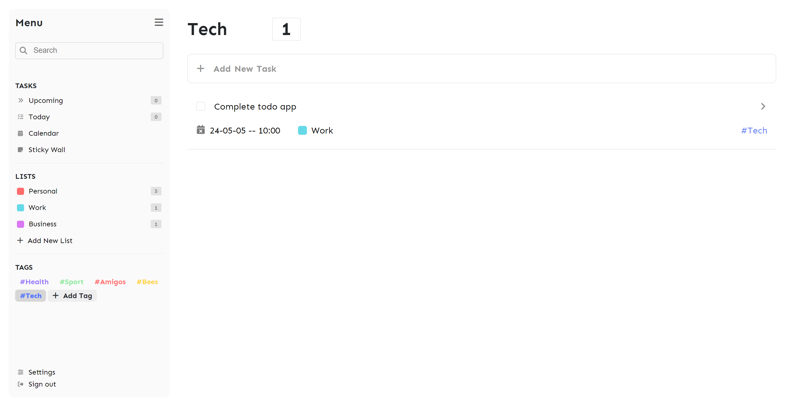

# Productive minds

Productive Minds is a web application designed to help people organize their lives by managing upcoming tasks and tracking their progress. It offers a simple, clear, and user-friendly interface.

## Table of contents

- [Productive minds](#productive-minds)
  - [Table of contents](#table-of-contents)
  - [Overview](#overview)
    - [Functionalities](#functionalities)
    - [Screenshot](#screenshot)
  - [My process](#my-process)
    - [Built with](#built-with)
  - [Note](#note)
  - [Author](#author)

## Overview

### Functionalities

Users should be able to:

- Create a new account.
- Log in using their credentials.
- Reset their password
- Logout.
- Manage their profile.
  - Update personal information.
  - Manage task categories.
  - Manage tags.
- Manage their tasks.
  - Create new tasks.
  - Update tasks.
  - Delete tasks.
  - Filter tasks by tag, category, or name.

### Screenshot

Desktop:

SIGN UP & SIGN IN & RESET PASSWORD
|  |  |  |
| :-----------------------------------------------------: | :-----------------------------------------------------: | :-----------------------------------------------------: |

TODAY & UPCOMING TASKS
|  |  |
| :-----------------------------------------------------: | :-----------------------------------------------------: |

TASK FILTERING
|  |  |  |
| :-----------------------------------------------------: | :-----------------------------------------------------: | :-----------------------------------------------------: |

CALENDAR
|  |
| :-----------------------------------------------------: |

STICKY WALL
|  |
| :-----------------------------------------------------: |

SETTINGS
|  |
| :-----------------------------------------------------: |

## My process

### Built with

- **Frontend:**
  - Angular ([https://angular.io/])
- **Backend:**
  - Node.js ([https://nodejs.org/en])
  - Express.js ([https://expressjs.com/])
- **Database:**
  - MongoDB ([https://www.mongodb.com/])
- **(Optional) Email:**
  - Nodemailer (for password resets)

## Note

Before running this. project, please ensure to set up the necessary environment variables in the backend folder. Specifically, make sure to add the connection string of your MongoDB database and Mailtrap credentials to the **config.env** file.

## Author

- Frontend Mentor - [@wess-MHHW](https://www.frontendmentor.io/profile/wess-MHHW)
- LeetCode - [@wess-MHHW](https://leetcode.com/wess-MHHW/)
- Linkedin - [@wassim-maaoui](https://www.linkedin.com/in/wassim-maaoui/)
